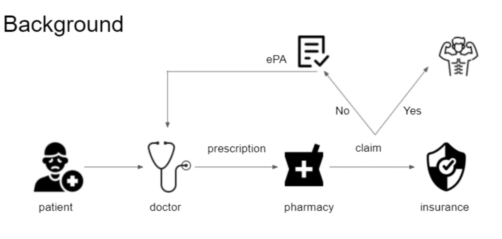

# CoverMyMeds_Project
### A team project to study prior authorization (PA) approval when patients are denied drug claims. Team members include: [Zhengchao Wan](https://zhengchaow.github.io)(wan.252@osu.edu), Qingsong Wang(wang.8973@osu.edu), Yuda Wang (wang.9023@osu.edu), Shuo Xu(xushuo0@gmail.com). This project was conducted during the 2021 Erdős Institute Data Bootcamp. 

We are dealing with datasets (inside the folder **CoverMyMeds_data**) provided by [CoverMyMeds](https://www.covermymeds.com/main/) which contains a list of drug claims, date of claims and status of PA requests. We use Logistic regression and random forest models to predict PA approval rates and use SARIMAX model to forecast monthly PA volume.

  

## Problem description
we mainly focus on these three problems:
1. What drugs are on insurance formulary?
2. How to predict a PA outcome?
3. Find insights why a PA request is rejected.
4. How to predict monthly PA volumes using historical data?

## Exploratory Data Analysis
**pa_frequency.ipynb** and **Exploratory Data Analysis.ipynb** are notebooks for exploratory data analysis.
We plot the claim approval against insurance companies and drug types to determine the formulary of each insurance company. We plot the PA approval against insurance companies, drug types, rejection codes, doctor’s diagnosis, patient’s medical history and doctor’s contraindication. We plot the time series data of the PA volumes aggregated at the daily and monthly level. The time series exhibits both seasonality and trend. 

## Predictive Model
### PA approval prediction
**Logistic.ipynb** is a notebook for PA approval prediction via logistic regression with fixed combination of company, drug type and rejection code.
**Logistic Regression with Interaction Terms.ipynb** is a notebook for PA approval prediction via logistic regression with interaction terms.
**random_forest_regression.ipynb** predicts the PA approval with random_forest model.
We picked six features (company, drug type,rejection code, doctor’s diagnosis, patient’s medical history and doctor’s contraindication) to run logistic regression. We conjecture that company, drug type, and rejection code will affect the marginal impact of the PA form answers on the PA approval rate. Thus we interact the three features with the PA form answers and include the interactions as features of the Logistic Regression model. We chose the 75:25 train/test split depending on time and used testing accuracy and AUC as measures. 

For random forest, we use company, drug type,rejection code, doctor’s diagnosis, patient’s medical history and doctor’s contraindication as features. We then use out-of-time split for cross validation. We obtain feature importance plot and also use SHAP value to explain the most significant feature. 

### Time series study
**Time Series.ipynb** is a notebook for PA volumes prediction via XGBoost, TBATS, and SARIMA models.
We aggregate the PA volumes at monthly level and plot the time series. There is a seasonality that volumes are high in January, and gradually decrease over the months. There is also a trend that the yearly average PA volume is increasing. We predicted the last 6 months of the PA volumes with various time series models, and evaluated them using measures such as mean squared error.

## Conclusion and Business insight
- Our model can help patients predict whether they will get PA approval by entering into information such as company, drug type,rejection code, doctor’s diagnosis, patient’s medical history and doctor’s contraindication. 

- When patients get a PA rejection, our model can help the patients to know what is the main cause of the PA disapproval.

- Our model has difficulties predicting the impact of new drugs. Our model can predict the impact of new drugs on PA approved rate provided quantitative comparisons between current drugs.

- This model can also be an add on to the medical system. Doctors could obtain relevant information and consequently provide prescriptions that will pass the claim or have a higher PA approved rate.
